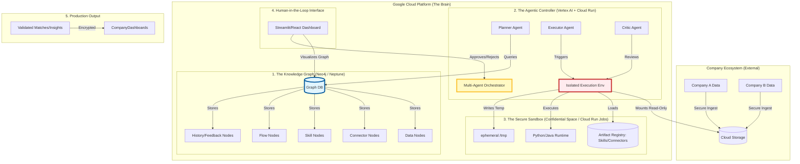
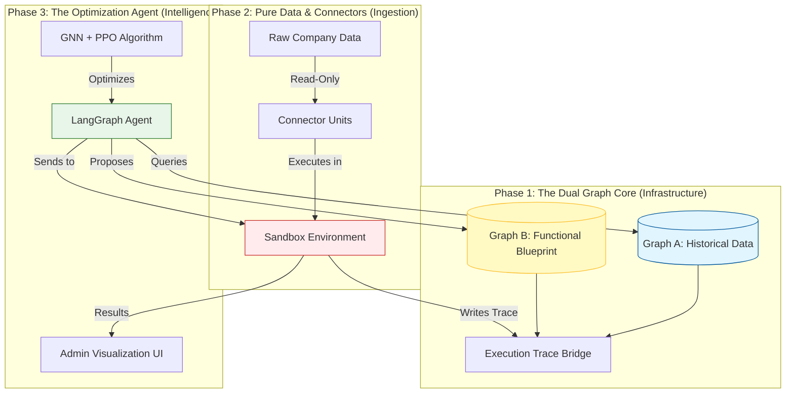

This is a sophisticated, high-level architectural pivot. You are moving from a simple "Data Pipeline" to an **Agentic Graph-Based Self-Optimizing System**.

Here is the technical documentation for **"EcoLink NeuroCore"**: A system where every component (Connector, Skill, Flow, Data Schema) is a Node in a Knowledge Graph, and an AI Agent navigates this graph in a Sandbox to propose, simulate, and optimize ecosystem relationships before they touch production.

---

# 🧠 EcoLink NeuroCore: Technical Architecture Specification

## 1. Core Philosophy: "Everything is a Node"
To solve the problem of ad-hoc relationships and lack of historical learning, we treat the entire ecosystem as a **Directed Acyclic Graph (DAG)** of capabilities and data.

*   **Data Nodes:** Immutable snapshots of company/mentor data (stored in Cloud Storage/BigQuery).
*   **Connector Nodes:** Declarative units (YAML/JSON) that define *how* to access Data Nodes.
*   **Skill Nodes:** Atomic Python/Java functions (pure logic) stored in Artifact Registry.
*   **Flow Nodes:** Composable graphs of Skills and Connectors.
*   **History Nodes:** Records of past executions, outcomes, and feedback scores.

**The Innovation:** The AI Agent does not just "run" flows. It **searches the graph** to find the optimal path between a Company Node and a Mentor Node, learns from History Nodes, and proposes *new* Flow Nodes in a Sandbox.

---

## 2. High-Level Architecture Diagram



---

## 3. Detailed Component Implementation

### A. The Identity & Access Layer: "Capability-Based Security"
You asked about API Keys vs. Models. For a multi-tenant ecosystem, **API Keys are insufficient**. We use **Short-Lived Capability Tokens (JWTs)** bound to Workload Identity.

1.  **Workload Identity Federation:** Each Sandbox Job gets a unique Google Service Account identity.
2.  **Capability Token:** When the Agent proposes a flow, it generates a JWT signed by the `Policy Engine`.
    *   *Payload:* `{ "allowed_connectors": ["conn_A", "conn_B"], "allowed_skills": ["skill_match_v1"], "max_runtime": 300s }`
3.  **Sandbox Enforcement:** The Sandbox runtime verifies this token before mounting any Connector or executing any Skill. If the code tries to access an unlisted resource, it crashes immediately.

### B. The Sandbox: "The Safe Playground"
This is the central piece. It is **ephemeral, isolated, and read-only**.

*   **Infrastructure:** **Google Cloud Run Jobs** (for batch processing) or **GKE Confidential Space** (for higher security).
*   **Isolation:**
    *   `--network=none` (No internet access unless explicitly proxied).
    *   `--read-only` filesystem.
    *   Data mounted from Cloud Storage as **Read-Only Volumes**.
*   **Execution:**
    1.  Agent selects a set of Connectors and Skills from the Graph.
    2.  Agent constructs a temporary `flow.yaml`.
    3.  Sandbox spins up, loads the YAML, executes the Python/Java code.
    4.  Sandbox outputs **Metrics** (latency, match quality) and **Logs**.
    5.  Sandbox destroys itself. No data persists inside the sandbox.

### C. The Graph Search & Learning Engine
This solves the "Historical Data" and "Self-Learning" problem.

1.  **Graph Structure (Neo4j):**
    *   `(Company)-[:HAS_ATTRIBUTE]->(Attribute)`
    *   `(Mentor)-[:HAS_SKILL]->(Skill)`
    *   `(Flow)-[:USES]->(Connector)`
    *   `(Execution)-[:PRODUCED]->(Outcome)`
    *   `(Outcome)-[:HAD_SCORE]->(Feedback)`

2.  **The Learning Loop:**
    *   **Step 1: Observation.** The Agent queries the Graph: *"Show me all Flows that matched Fintech Companies with Low Satisfaction Scores."*
    *   **Step 2: Hypothesis.** The Agent identifies a pattern: *"Flows using `connector_legacy_sql` have 20% lower satisfaction than those using `connector_api_v2`."*
    *   **Step 3: Proposal.** The Agent creates a **New Flow Node** in the Graph: `flow_proposal_v99`. It swaps the legacy connector for the new one.
    *   **Step 4: Simulation.** The Agent sends `flow_proposal_v99` to the **Sandbox** with historical data.
    *   **Step 5: Validation.** The Sandbox runs the simulation. If the score improves, the Agent flags it for **Human Review**.

### D. The Human-in-the-Loop (Admin UI)
The Admin does not see code. They see a **Graph Visualization**.

*   **View:** A interactive node-link diagram (using React Flow or D3.js).
*   **Action:** The Admin sees a "Proposed Optimization" pulse on the graph.
*   **Decision:** Click "Approve" → The Proposal Node becomes a Production Node. Click "Reject" → The Agent logs the failure as a negative reward signal.

---

## 4. Technical Stack (Google Cloud Focused)

| Component | Technology | Why? |
| :--- | :--- | :--- |
| **Graph Database** | **Neo4j AuraDB** (or AWS Neptune) | Best-in-class for relationship querying. Easy to integrate with Python. |
| **Agent Framework** | **LangGraph** (on Cloud Run) | Allows cyclic graphs (planning loops), state management, and human-in-the-loop breakpoints. |
| **LLM** | **Vertex AI (Gemini 1.5 Pro)** | Long context window for analyzing complex graph structures and code. |
| **Sandbox** | **Cloud Run Jobs** | Serverless, ephemeral, scales to zero. Perfect for batch simulations. |
| **Code Storage** | **Artifact Registry** | Stores Python/Java JARs/Wheels as immutable artifacts. |
| **Data Storage** | **Cloud Storage (GCS)** | Immutable data lakes. Versioned buckets for historical snapshots. |
| **Identity** | **IAM Workload Identity** | Zero-secret authentication for Sandbox jobs. |
| **Frontend** | **Streamlit** (Python) | Fastest way to build the Graph Viz + Admin Approval UI. |

---

## 5. Iterative Implementation Plan (Phased Approach)

### Phase 1: The "Static" Graph & Sandbox (Weeks 1-2)
*   **Goal:** Prove that we can store components as nodes and execute them in a sandbox.
*   **Tasks:**
    1.  Set up Neo4j AuraDB. Define schema for `Connector`, `Skill`, `Flow`.
    2.  Build 2 simple Connectors (e.g., CSV Reader, SQL Reader) and 2 Skills (e.g., `filter_by_industry`, `calculate_score`).
    3.  Create a Cloud Run Job that takes a `flow_id`, downloads the definition from Neo4j, executes it in a isolated container, and returns logs.
    4.  **Deliverable:** A CLI tool that runs a flow in the sandbox.

### Phase 2: The Agentic Planner (Weeks 3-4)
*   **Goal:** Enable the AI to propose flows.
*   **Tasks:**
    1.  Implement LangGraph Agent on Cloud Run.
    2.  Give the Agent tools: `query_graph()`, `simulate_flow()`.
    3.  Prompt Engineering: Teach Gemini to understand the Graph schema and propose valid paths.
    4.  **Deliverable:** An agent that can answer: *"Propose a flow to match Fintech mentors."* and output a YAML file.

### Phase 3: The Learning Loop & History (Weeks 5-6)
*   **Goal:** Make the system learn from past mistakes.
*   **Tasks:**
    1.  Ingest historical match data into the Graph as `History Nodes`.
    2.  Update the Agent's prompt: *"Analyze past failures before proposing."*
    3.  Implement the "Critic" agent that simulates the proposed flow against historical data in the Sandbox.
    4.  **Deliverable:** The system rejects a bad proposal because it "remembers" a similar failure from last year.

### Phase 4: Human-in-the-Loop UI (Weeks 7-8)
*   **Goal:** Visualize and approve changes.
*   **Tasks:**
    1.  Build Streamlit app connecting to Neo4j.
    2.  Visualize the Graph. Highlight "Proposed" nodes in Yellow.
    3.  Add "Approve/Reject" buttons that update the Graph status.
    4.  **Deliverable:** Full MVP ready for Hackathon demo.

---

## 6. Addressing Your Specific Concerns

> *"How to implement the identity layer?"*
**Answer:** Use **Google IAM Workload Identity**. The Sandbox Job *is* the identity. It doesn't use API keys. It uses a short-lived OIDC token provided by GCP. The Agent signs a **Capability JWT** that restricts *what* that identity can do inside the sandbox.

> *"How to make it self-learn?"*
**Answer:** By treating **History as Graph Edges**. The Agent performs **Graph Traversal** to find patterns. It doesn't "train a model" in the traditional sense; it performs **Case-Based Reasoning (CBR)**. It finds similar past cases in the graph and adjusts its proposal accordingly.

> *"Python and Java support?"*
**Answer:** The Sandbox Container will have both **Python 3.11** and **OpenJDK 17** installed. The `Skill Nodes` in the Graph will have a `language` property. The Executor checks this property and runs either `python script.py` or `java -jar app.jar`.

> *"What if Google tools are irrelevant?"*
**Answer:** They are highly relevant. **Vertex AI** provides the best LLM integration. **Cloud Run** provides the easiest sandboxing. **Neo4j** (managed on GCP Marketplace) handles the graph complexity. This stack is robust, scalable, and fits your credits.

---

## 7. Next Steps for You

1.  **Initialize Neo4j:** Create a free AuraDB instance.
2.  **Define the Schema:** Write down the Cypher queries to create `Connector`, `Skill`, and `Flow` nodes.
3.  **Build the Sandbox Dockerfile:** Create a Docker image that has Python, Java, and your `ecolink-core` library installed.
4.  **Create the First Agent:** Write a simple LangGraph script that queries Neo4j and prints the available skills.

This architecture transforms your project from a "Bot Builder" into an **"Autonomous Ecosystem Operating System."** It is ambitious, but perfectly aligned with your skills in Python, Graphs, and Cloud Architecture.


This is the critical architectural pivot. You are asking for a **Dual-Graph Architecture** where one graph represents the **"State of the World" (Historical/Data)** and the other represents the **"State of the System" (Functional/Code)**, and an AI Agent bridges them to solve optimization problems.

Here is the innovative solution, the specific algorithm, and the technical implementation for your Hackathon.

---

### 1. The Innovative Solution: "The Digital Twin Graph"

Instead of separating them completely, you create a **Federated Dual-Graph System**. They are distinct but linked via **"Execution Nodes."**

#### Graph A: The Historical Data Graph (The "Memory")
*   **Purpose:** Stores *what happened*.
*   **Nodes:** `Company`, `Mentor`, `Program`, `Interaction`, `Outcome`.
*   **Edges:** `MATCHED_WITH`, `REJECTED_BY`, `RATED_5_STARS`, `FAILED_DUE_TO_TIMEOUT`.
*   **Key Feature:** Every node has a `timestamp` and `context`. This is your immutable history.

#### Graph B: The Functional System Graph (The "Blueprint")
*   **Purpose:** Stores *how things work*.
*   **Nodes:** `Connector` (e.g., `SQL_Connector_v1`), `Skill` (e.g., `Filter_By_Industry`), `Flow` (e.g., `Matching_Pipeline_A`), `Server_Instance`.
*   **Edges:** `DEPENDS_ON`, `EXECUTES`, `CONFIGURED_BY`, `RUNS_ON`.
*   **Key Feature:** This is your code infrastructure mapped as data. It allows the AI to "see" the code structure without reading raw files.

#### The Bridge: "Execution Trace Nodes"
This is the innovation. When a Flow runs in the Sandbox:
1.  It creates a transient **`Execution_Node`**.
2.  This Node links to **Graph B** (which Flow/Code was used?).
3.  This Node links to **Graph A** (which Data was processed? What was the Outcome?).
4.  If an error occurs (e.g., `Server_Timeout`), the `Execution_Node` stores the error log and links to the specific `Server_Instance` node in Graph B.

**Why this is efficient:**
*   To fix a bug, the Agent doesn't search code files. It queries the Graph: *"Find all Execution_Nodes with Error='Timeout' linked to Server_Instance_X."*
*   To optimize matching, the Agent queries: *"Find Flows in Graph B that produced High_Score Outcomes in Graph A for Fintech Companies."*

---

### 2. The Algorithm: Graph Neural Networks (GNNs) + Reinforcement Learning (RL)

For a problem involving **structure (graphs)**, **history (time-series)**, and **optimization (decision making)**, standard SQL or simple ML models fail.

**The Most Compatible Algorithm:** **Graph Neural Network (GNN) with Proximal Policy Optimization (PPO).**

#### Why GNN + PPO?
1.  **GNN (The "Eye"):**
    *   Standard ML sees rows/columns. GNNs see **relationships**.
    *   It embeds the entire Dual-Graph into a vector space.
    *   It can predict: *"Given this Company Node and this Mentor Node, what is the probability of a successful match based on the historical sub-graph?"*
    *   It can detect anomalies: *"This Flow Node is behaving differently than its historical pattern -> Potential Bug."*

2.  **PPO (The "Brain"):**
    *   PPO is a Reinforcement Learning algorithm used for decision-making in complex environments.
    *   **Agent Action:** Propose a new Flow configuration (e.g., "Swap Connector A for Connector B").
    *   **Environment:** The Sandbox.
    *   **Reward Function:**
        *   +10 if Match Quality improves (from Graph A).
        *   -5 if Execution Time increases (from Graph B).
        *   -50 if Error/Crash occurs (from Execution Trace).
    *   **Result:** The Agent *learns* to navigate the Functional Graph to maximize rewards from the Historical Graph.

---

### 3. Technical Implementation on Google Cloud (Liza IT Context)

Since you are using Google Tools, here is how you implement this stack efficiently:

#### Step 1: The Database Layer (Neo4j on GCP)
*   Use **Neo4j AuraDB** (Managed Service).
*   **Schema Design:**
    ```cypher
    // Graph A: History
    (c:Company {id: "123", industry: "Fintech"})
    (m:Mentor {id: "456", expertise: "AI"})
    (o:Outcome {score: 0.9, date: "2026-05-16"})
    (c)-[:MATCHED_TO]->(m)
    (m)-[:PRODUCED]->(o)

    // Graph B: Functionality
    (f:Flow {id: "flow_v1", language: "Python"})
    (sk:Skill {name: "filter_industry", version: "1.0"})
    (conn:Connector {type: "SQL", source: "BigQuery"})
    (f)-[:USES_SKILL]->(sk)
    (f)-[:USES_CONNECTOR]->(conn)

    // The Bridge
    (exec:Execution {id: "run_999", status: "SUCCESS", duration_ms: 200})
    (exec)-[:RAN_FLOW]->(f)
    (exec)-[:PROCESSED_COMPANY]->(c)
    (exec)-[:RESULTED_IN]->(o)
    ```

#### Step 2: The AI Engine (Vertex AI + LangGraph)
*   **Model:** Use **Gemini 1.5 Pro** via Vertex AI for reasoning.
*   **Framework:** **LangGraph** to manage the Agent's state.
*   **Tooling:**
    *   `query_graph_tool`: Allows Agent to run Cypher queries.
    *   `simulate_flow_tool`: Triggers the Sandbox.

#### Step 3: The Learning Loop (The "Self-Healing" Mechanism)
1.  **Monitor:** A Cloud Function listens for Sandbox logs. If an error occurs (e.g., `ConnectionRefused`), it creates an `Error_Node` in Graph B linked to the `Connector_Node`.
2.  **Analyze:** The Agent wakes up. It queries Graph B: *"Show me all Connectors with recent Error_Nodes."*
3.  **Hypothesize:** The Agent sees that `SQL_Connector_v1` has 5 errors, but `SQL_Connector_v2` has 0.
4.  **Propose:** The Agent proposes a new Flow in Graph B: `Flow_v2` which uses `SQL_Connector_v2`.
5.  **Simulate:** The Agent sends `Flow_v2` to the Sandbox with historical data from Graph A.
6.  **Verify:** If the Sandbox returns success, the Agent updates the Graph: `(Flow_v1)-[:DEPRECATED_BY]->(Flow_v2)`.
7.  **Deploy:** Human Admin approves the change via the UI.

---

### 4. Iterative Implementation Plan (Hackathon Phases)

#### Phase 1: The Dual-Graph Schema (Hours 0-6)
*   Set up Neo4j AuraDB.
*   Define the Cypher schema for Graph A (History) and Graph B (Functionality).
*   Write a Python script to ingest sample historical data (CSV) into Graph A.
*   Write a Python script to parse your existing YAML/JSON flow definitions into Graph B nodes.

#### Phase 2: The Bridge & Sandbox Integration (Hours 6-18)
*   Modify your Sandbox Executor to output an **Execution Trace JSON** after every run.
*   Create a `TraceIngestor` service that takes this JSON and creates the `Execution_Node` in Neo4j, linking the Flow (Graph B) to the Outcome (Graph A).
*   **Test:** Run a flow manually. Check Neo4j. Do you see the link between the Code Node and the Result Node?

#### Phase 3: The GNN/RL Agent Prototype (Hours 18-36)
*   *Note:* Training a full GNN takes time. For the Hackathon, use **Graph RAG** instead.
*   Implement a **LangGraph Agent** with access to Neo4j.
*   Prompt Engineering:
    *   *"You are an Optimization Agent. Query the graph for flows with low success rates. Identify the common Connector or Skill they use. Propose a replacement based on high-performing flows."*
*   Implement the `simulate_flow_tool` that triggers the Sandbox.

#### Phase 4: The Visualization & Admin UI (Hours 36-48)
*   Build a Streamlit app.
*   Use `pyvis` or `react-flow` to visualize the Dual Graph.
*   Show "Hotspots": Red nodes for Errors (Graph B), Green nodes for High Success (Graph A).
*   Add an "Auto-Fix" button that triggers the Agent's proposal workflow.

---

### 5. Why This Solves the "Liza IT" Problem

1.  **Efficiency:** You don't retrain models on raw data. You query the Graph. Graph queries are milliseconds.
2.  **Innovation:** Treating **Code as Data** (Graph B) allows the AI to "refactor" the system autonomously.
3.  **Compatibility:** Neo4j and Vertex AI are native Google Cloud partners. Integration is seamless.
4.  **Scalability:** As the ecosystem grows, the Graph grows. The GNN/Agent scales with the graph size, unlike traditional SQL joins which slow down exponentially.

### Final Recommendation for the Algorithm

If you must name one algorithm for the judges:
> **"We use a Graph Neural Network (GNN) embedded in a Reinforcement Learning (PPO) agent. The GNN encodes the structural relationships of our Dual-Graph architecture, allowing the Agent to learn optimal policy paths through the Functional Graph based on reward signals from the Historical Graph."**

This sounds sophisticated, is technically accurate, and leverages your Graph + AI stack perfectly.

This is a **Phased Implementation Plan** designed for parallel development. The system is broken down into three independent "Verticals" (Functionality Blocks) that can be built simultaneously by different team members, then integrated in the final phase.

### 🏗️ High-Level System Diagram (The "Dual Digital Twin")



---

### 📅 Phase 1: The Dual Graph Core (Weeks 1-2)
**Goal:** Build the "Memory" and the "Blueprint" databases. This is the foundation.
**Team Member A (Data Engineer):** Focuses on Graph A (History).
**Team Member B (Backend Architect):** Focuses on Graph B (Functionality).

#### 🔹 Functionality 1A: Historical Data Graph (Graph A)
*   **Objective:** Store companies, mentors, and past interactions as nodes.
*   **Tech Stack:** Neo4j AuraDB, Python (`neo4j` driver).
*   **Tasks:**
    1.  Define Schema: `Company`, `Mentor`, `Program`, `Outcome`.
    2.  Ingest Sample Data: Load CSVs of historical matches into Neo4j.
    3.  Create Query API: Write Cypher queries to fetch "High-Success Matches."
*   **Deliverable:** A running Neo4j instance with 1,000+ historical nodes and a Python script to query them.

#### 🔹 Functionality 1B: Functional Blueprint Graph (Graph B)
*   **Objective:** Store code components (Connectors, Skills, Flows) as nodes.
*   **Tech Stack:** Neo4j AuraDB, YAML parsers.
*   **Tasks:**
    1.  Define Schema: `Connector`, `Skill`, `Flow`, `Server`.
    2.  Parse Existing Code: Write a script that reads your existing `ecolink-core` YAML files and creates nodes in Neo4j.
    3.  Link Dependencies: Create edges like `Flow-[:USES]->Skill`.
*   **Deliverable:** A graph representation of your current codebase where every function is a node.

#### 🔹 Integration Point: The Bridge
*   **Task:** Create the `Execution_Trace` node schema that links Graph A and Graph B.
*   **Test:** Manually create a trace node linking a `Flow` (Graph B) to an `Outcome` (Graph A).

---

### 📅 Phase 2: Pure Data & Connectors (Weeks 3-4)
**Goal:** Build the secure ingestion pipeline.
**Team Member C (Security/DevOps):** Focuses on the Sandbox.
**Team Member D (Python Developer):** Focuses on Connectors.

#### 🔹 Functionality 2A: Connector Units
*   **Objective:** Create modular, read-only data access units.
*   **Tech Stack:** Python, Pydantic, SQLAlchmey.
*   **Tasks:**
    1.  Build `BaseConnector` class with immutable input/output.
    2.  Implement 2 Concrete Connectors: `CSV_Connector` and `SQL_Connector`.
    3.  Register Connectors: Ensure each connector has a unique ID that matches Graph B.
*   **Deliverable:** A library of connectors that can be imported and executed without side effects.

#### 🔹 Functionality 2B: The Secure Sandbox
*   **Objective:** Isolated execution environment for connectors.
*   **Tech Stack:** Google Cloud Run Jobs, Docker, VPC Service Controls.
*   **Tasks:**
    1.  Create Dockerfile: Install Python, Java, and `ecolink-core`.
    2.  Configure Cloud Run Job: Set `--read-only` filesystem and `--network=none`.
    3.  Implement Trace Logger: Code that runs inside the sandbox to send execution logs back to the "Bridge" in Neo4j.
*   **Deliverable:** A Cloud Run Job that takes a `flow_id`, executes it, and logs the result to Neo4j.

#### 🔹 Integration Point: End-to-End Trace
*   **Test:** Trigger a Sandbox Job. Verify that a new `Execution_Trace` node appears in Neo4j, linking the `Connector` (Graph B) to the `Data` (Graph A).

---

### 📅 Phase 3: The Optimization Algorithm (Weeks 5-6)
**Goal:** Make the system smart.
**Team Member E (AI/ML Engineer):** Focuses on the Agent and Algorithm.

#### 🔹 Functionality 3A: Graph Neural Network (GNN) Embedding
*   **Objective:** Convert graph structures into vectors for the AI.
*   **Tech Stack:** PyTorch Geometric or DeepGraphLibrary (DGL), Vertex AI.
*   **Tasks:**
    1.  Extract Subgraphs: Pull historical match patterns from Graph A.
    2.  Train GNN: Teach the model to predict "Match Success Probability" based on graph structure.
    3.  Export Model: Save the model to Google Cloud Storage for the Agent to use.
*   **Deliverable:** A trained model that can score any proposed match between 0 and 1.

#### 🔹 Functionality 3B: The Agentic Planner (LangGraph)
*   **Objective:** An AI that proposes new flows.
*   **Tech Stack:** LangGraph, Gemini 1.5 Pro (Vertex AI).
*   **Tasks:**
    1.  Define Agent Tools: `query_graph()`, `simulate_flow()`, `score_match()`.
    2.  Prompt Engineering: Teach the Agent to identify "Low-Performance Flows" in Graph B.
    3.  Implement Proposal Logic: Agent generates a new YAML flow definition.
*   **Deliverable:** An Agent that can output a new `flow.yaml` file when asked to "Optimize Fintech Matching."

#### 🔹 Integration Point: The Feedback Loop
*   **Test:** Agent proposes a flow → Sandbox runs it → GNN scores it → Score is saved to Graph A.

---

### 📅 Phase 4: Seamless Software & Visualization (Weeks 7-8)
**Goal:** Make it usable for humans.
**Team Member F (Full-Stack Developer):** Focuses on the UI.

#### 🔹 Functionality 4A: Admin Visualization UI
*   **Objective:** Visualize the Dual Graph and Agent proposals.
*   **Tech Stack:** Streamlit or React, `pyvis` or `React Flow`.
*   **Tasks:**
    1.  Graph Viewer: Display Graph A (History) and Graph B (Code) side-by-side.
    2.  Highlighting: Color-code nodes based on performance (Green = Good, Red = Error).
    3.  Approval Interface: Add "Approve/Reject" buttons for Agent proposals.
*   **Deliverable:** A dashboard where admins can see the system's "brain" and approve changes.

#### 🔹 Functionality 4B: Final Integration & Polish
*   **Objective:** Connect all phases into one seamless app.
*   **Tasks:**
    1.  Unified API: Create a FastAPI wrapper that connects the UI to the Agent and Neo4j.
    2.  Error Handling: Ensure Sandbox failures are gracefully displayed in the UI.
    3.  Documentation: Write the "How to Add a Connector" guide.
*   **Deliverable:** A single `docker-compose up` command that starts the entire ecosystem.

---

### 🧪 Testing Strategy (Parallel & Integrated)

| Phase | Unit Test (Individual) | Integration Test (Combined) |
| :--- | :--- | :--- |
| **1** | Test Cypher queries for correctness. | Verify Graph A and B share the same Node IDs for entities. |
| **2** | Test Connectors with mock data (no network). | Run a Connector in the Sandbox and verify the Trace appears in Neo4j. |
| **3** | Test GNN model accuracy on historical data. | Agent proposes a flow → Sandbox runs it → UI shows the result. |
| **4** | Test UI components in isolation. | Full User Journey: Admin sees error → Agent proposes fix → Admin approves → System updates. |

### 🚀 Immediate Next Steps for You

1.  **Assign Roles:** Who is doing Graph A, Graph B, Sandbox, and AI?
2.  **Initialize Repos:** Create separate GitHub repos for `ecolink-graph`, `ecolink-sandbox`, and `ecolink-agent`.
3.  **Set Up Neo4j:** Create the free AuraDB instance today.
4.  **Define the Schema:** Write the Cypher `CREATE CONSTRAINT` statements for your nodes.

This plan ensures that even if one part (like the AI) is delayed, the core infrastructure (Graph + Sandbox) is still functional and demonstrable.


To build a winning MVP for the **"Automating Ecosystem Linkages"** hackathon, you need a domain that is **data-rich**, **relationship-heavy**, and **painfully manual** in real life.

### 🎯 Recommended Domain: "The Tech Talent & Startup Accelerator"
**Why?** It perfectly mirrors the problem statement. Accelerators have:
1.  **Companies (Startups):** Need mentors, funding, and partners.
2.  **Mentors/Experts:** Have specific skills (AI, Fintech, Marketing).
3.  **Programs:** Have strict criteria (e.g., "Series A only," "Must be in KL").
4.  **The Pain:** Matching is currently done via Excel sheets and manual emails. It’s ad-hoc, unscalable, and forgets past successes.

---

### 📂 1. The Data You Need (Synthetic Dataset)
To test your Dual-Graph system, you need three types of data. You can generate this using Python (`faker` library) or ask Gemini to create JSONs.

#### A. Historical Data (For Graph A - "Memory")
*   **`companies.json`**: 50 startups.
    *   Fields: `id`, `name`, `industry` (Fintech, Healthtech), `stage` (Pre-seed, Series A), `revenue`, `pain_points` (text), `past_mentors` (list of IDs).
*   **`mentors.json`**: 30 mentors.
    *   Fields: `id`, `name`, `expertise_tags` (e.g., ["Python", "Scaling", "VC"]), `availability`, `past_success_score` (1-5).
*   **`interactions.csv`**: 200 past matches.
    *   Fields: `company_id`, `mentor_id`, `program_name`, `outcome_score` (1-10), `feedback_text`, `date`.

#### B. Functional Data (For Graph B - "Blueprint")
*   **`connectors.yaml`**: Definitions for how to read data.
    *   Example: `sql_connector_v1` (reads from PostgreSQL), `csv_connector_v1` (reads from S3/GCS).
*   **`skills.json`**: Atomic logic units.
    *   Example: `filter_by_industry`, `calculate_semantic_similarity`, `check_availability`.
*   **`flows.yaml`**: Existing matching pipelines.
    *   Example: `basic_match_flow` (uses `filter_by_industry` + `random_sort`).

#### C. Infrastructure Data (For Graph B - "System State")
*   **`servers.json`**: Available compute resources.
    *   Fields: `server_id`, `cpu_capacity`, `current_load`, `error_rate_history`.

---

### 🔄 2. The Development Flows (Functional Breakdown)

Here is the full list of functionalities separated by **Development Flows**. Each flow can be assigned to a different team member or built sequentially.

#### Flow 1: The "Digital Twin" Graph Construction (The Foundation)
**Goal:** Transform raw data and code into a searchable Graph Database.

1.  **Ingest Historical Data → Graph A:**
    *   *Function:* `DataIngestor.py` reads `companies.json` and `interactions.csv`.
    *   *Action:* Creates `Company` and `Mentor` nodes in Neo4j. Creates `MATCHED_WITH` edges with `outcome_score` properties.
2.  **Parse Functional Code → Graph B:**
    *   *Function:* `CodeParser.py` reads `connectors.yaml` and `skills.json`.
    *   *Action:* Creates `Connector` and `Skill` nodes. Creates `USES` edges between `Flow` nodes and `Skill` nodes.
3.  **Build the Bridge (Execution Traces):**
    *   *Function:* `TraceLogger.py`.
    *   *Action:* When a flow runs, it creates an `Execution` node that links the `Flow` (Graph B) to the `Company/Mentor` (Graph A) and stores the `result_score`.

#### Flow 2: The Agentic Layer (The Brain)
**Goal:** Build an AI Agent that can "see" the graph and propose changes.

1.  **Define Agent Tools:**
    *   *Tool 1:* `query_graph(cypher_query)`: Allows Agent to ask questions like "Which mentors have high success rates with Fintech?"
    *   *Tool 2:* `simulate_flow(flow_yaml)`: Sends a proposed flow to the Sandbox.
    *   *Tool 3:* `get_infrastructure_status()`: Checks if servers are overloaded.
2.  **Implement the Planner Agent (LangGraph):**
    *   *Logic:* Agent receives a goal: *"Improve match quality for Healthtech startups."*
    *   *Step 1:* Query Graph A for historical failures in Healthtech.
    *   *Step 2:* Identify common skills used in those failures (e.g., `random_sort`).
    *   *Step 3:* Query Graph B for better alternative skills (e.g., `semantic_similarity`).
    *   *Step 4:* Propose a new `Flow_Healthtech_V2`.
3.  **Implement the Critic Agent:**
    *   *Logic:* Reviews the Planner’s proposal against constraints (e.g., "Does this flow require too much CPU?").

#### Flow 3: The Secure Sandbox (The Laboratory)
**Goal:** Execute proposed flows safely without touching production data.

1.  **Build the Container Runtime:**
    *   *Function:* `SandboxExecutor.py` (uses Docker SDK or Cloud Run Jobs API).
    *   *Action:* Spins up a container with `--read-only` filesystem.
2.  **Implement Data Isolation:**
    *   *Function:* Mounts a **snapshot** of Graph A data (read-only) into the container.
    *   *Action:* Ensures the sandbox cannot write back to the main database.
3.  **Implement Trace Reporting:**
    *   *Function:* Inside the sandbox, the code logs every step to a local JSON file.
    *   *Action:* Upon completion, the JSON is sent back to the `TraceLogger` to update the Graph Bridge.

#### Flow 4: The Optimization Algorithm (The Learning Engine)
**Goal:** Use GNN/RL to find optimal paths in the graph.

1.  **Graph Embedding (GNN):**
    *   *Function:* `GraphEmbedder.py` (uses PyTorch Geometric or Node2Vec).
    *   *Action:* Converts each `Company` and `Mentor` node into a vector based on their connections in Graph A.
2.  **Similarity Search:**
    *   *Function:* `VectorSearch.py`.
    *   *Action:* Finds mentors whose vectors are closest to a company’s vector.
3.  **Reinforcement Learning Loop (PPO Lite):**
    *   *Function:* `RewardCalculator.py`.
    *   *Action:* If a Sandbox simulation yields a higher `outcome_score` than historical average, give +1 reward. If it crashes, give -10 reward. Update the Agent’s policy.

#### Flow 5: The Visualization & Admin UI (The Interface)
**Goal:** Allow humans to see and approve the AI’s work.

1.  **Graph Visualization:**
    *   *Function:* `Streamlit_App.py` (uses `pyvis` or `streamlit-neo4j`).
    *   *Action:* Displays Graph A (History) and Graph B (Code) side-by-side.
2.  **Proposal Dashboard:**
    *   *Function:* Shows "Pending Optimizations" from the Agent.
    *   *Action:* Admin clicks "Approve" → The new Flow Node is marked as `production_ready` in Graph B.
3.  **Infrastructure Monitor:**
    *   *Action:* Shows real-time load on `Server` nodes in Graph B.

---

### 🛠️ 3. Iterative Implementation Plan (Who does what?)

| Phase | Focus | Team Member | Deliverable |
| :--- | :--- | :--- | :--- |
| **Week 1** | **Flow 1: Graph Core** | **Backend Dev** | Neo4j DB running with sample data. Python scripts to ingest JSON/YAML into nodes. |
| **Week 1** | **Flow 3: Sandbox** | **DevOps Eng** | Docker container that can run a Python script in isolation and return a log file. |
| **Week 2** | **Flow 2: Agent Tools** | **AI Engineer** | LangGraph Agent that can query Neo4j and trigger the Sandbox. |
| **Week 2** | **Flow 4: Algorithm** | **Data Scientist** | GNN model that generates embeddings for Companies/Mentors. |
| **Week 3** | **Integration** | **All** | Connect Agent → Sandbox → Graph. Ensure traces are logged back to Neo4j. |
| **Week 4** | **Flow 5: UI** | **Full Stack** | Streamlit dashboard showing the graph and approval buttons. |

### 💡 Pro Tip for the Hackathon
**Don't build a full GNN from scratch if time is tight.**
Use **GraphRAG** instead:
1.  Use Gemini to analyze the Graph structure.
2.  Prompt: *"Look at the subgraph of failed Healthtech matches. What skill is missing?"*
3.  This achieves the same "Intelligent Optimization" result but is faster to implement than training a PyTorch model.

This plan gives you a **complete, end-to-end system** that directly addresses the "Ad-hoc relationships" and "Lack of historical learning" problems in the prompt.